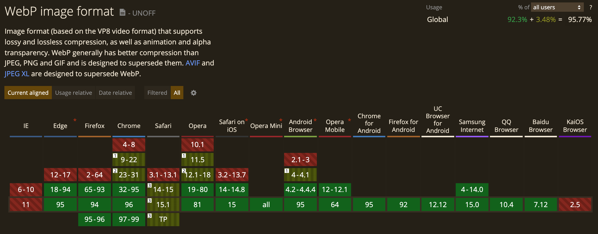

# image-to-webp

provides a API to convert image(JPG, PNG) -> WEBP

WebP is a modern image format that provides superior lossless and lossy compression for images on the web. Using WebP, webmasters and web developers can create smaller, richer images that make the web faster.

The purpose of this repository is a project to convert image files to the next generation image format (webp).

## Support


## Installation
### For Docker
1. git clone
```bash
git clone git@github.com:shoridevel/image-to-webp.git
```
2. docker build
```bash
docker build ./ -t image-to-webp
```
3. docker run
```bash
docker run -d -p 3001:3001 --name image-to-webp image-to-webp
```
4. Check with cURL
```bash
curl -v "http://localhost:3001" -X POST -F file=@image.jpg -o image.webp
```

### For Mac
1. install & download [download](https://developers.google.com/speed/webp/download)
   See also - [cwebp](https://developers.google.com/speed/webp)

2. Add cwebp path
```bash
export PATH="$PATH:/<Set your path>/libwebp-1.2.1-mac-10.15/bin"
```
3. node package install
```bash
yarn install
```
4. run

For development
```bash
yarn dev
```

For Production
```bash
yarn start
```

## Usage
### Check the details with API
[http://localhost:3001/api-docs](http://localhost:3001/api-docs/)

option params

```
q=50（quality 1~100, Optional pamameter）
```

You can reduce the size of the image file by specifying the image quality.

```bash
curl "localhost:3001/" -X POST -F image_file=@image.png -F q=75 -o image.webp
```

or just simply call:

```bash
curl "localhost:3001/" -X POST -F image_file=@image.png -o image.webp
```

## Before(1.6MB) → Reduced image size by -77%


## After(330KB)


## Before(2.3MB) → Reduced image size by -84%


## After(1MB)


